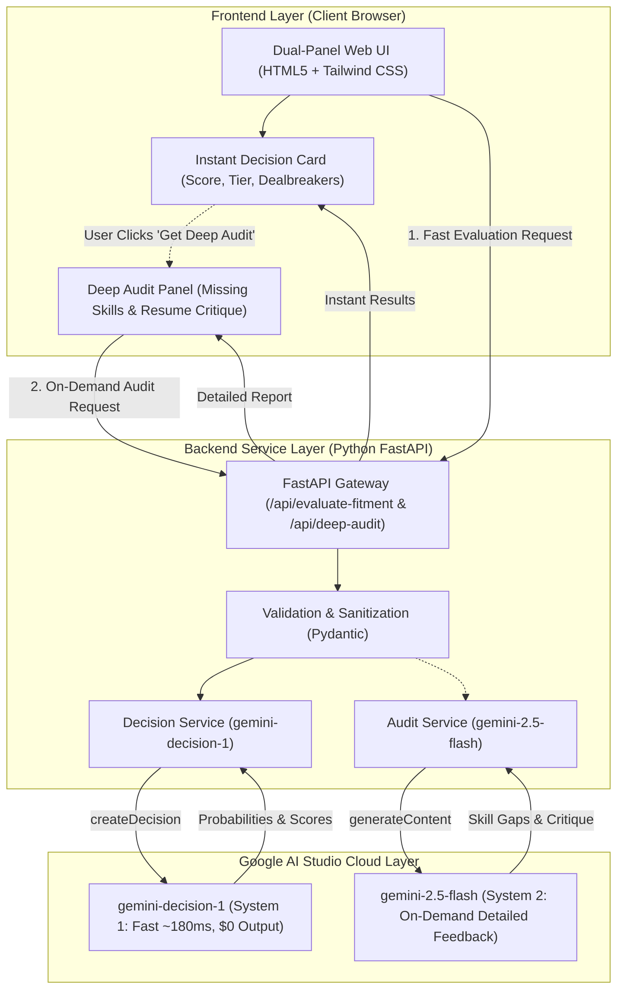
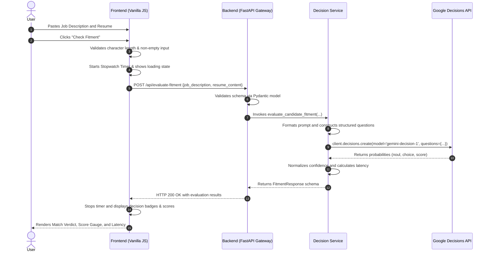

# System Architecture & Orchestration Plan
## Project: AI Job-Resume Fitment Matcher

### 1. High-Level Architecture Overview (Hybrid System-1 + System-2)

```mermaid
flowchart TD
    subgraph Client["Frontend Layer (Client Browser)"]
        UI["Dual-Panel Web UI (HTML5 + Tailwind CSS)"]
        PHASE1_VIEW["Instant Decision Card (Score, Tier, Dealbreakers)"]
        PHASE2_VIEW["Deep Audit Panel (Missing Skills & Resume Critique)"]
        UI --> PHASE1_VIEW
        PHASE1_VIEW -.->|"User Clicks 'Get Deep Audit'"| PHASE2_VIEW
    end

    subgraph Server["Backend Service Layer (Python FastAPI)"]
        API["FastAPI Gateway (/api/evaluate-fitment & /api/deep-audit)"]
        VAL["Validation & Sanitization (Pydantic)"]
        DEC_SVC["Decision Service (gemini-decision-1)"]
        GEN_SVC["Audit Service (gemini-2.5-flash)"]
        
        API --> VAL
        VAL --> DEC_SVC
        VAL -.-> GEN_SVC
    end

    subgraph Cloud["Google AI Studio Cloud Layer"]
        MODEL1["gemini-decision-1 (System 1: Fast ~180ms, $0 Output)"]
        MODEL2["gemini-2.5-flash (System 2: On-Demand Detailed Feedback)"]
    end

    UI -->|"1. Fast Evaluation Request"| API
    DEC_SVC -->|"createDecision"| MODEL1
    MODEL1 -->|"Probabilities & Scores"| DEC_SVC
    API -->|"Instant Results"| PHASE1_VIEW

    PHASE2_VIEW -->|"2. On-Demand Audit Request"| API
    GEN_SVC -->|"generateContent"| MODEL2
    MODEL2 -->|"Skill Gaps & Critique"| GEN_SVC
    API -->|"Detailed Report"| PHASE2_VIEW
```

---

### 2. End-to-End Data Flow

```mermaid
sequenceDiagram
    autonumber
    actor User
    participant Frontend as Frontend (Vanilla JS)
    participant FastAPI as Backend (FastAPI Gateway)
    participant Service as Decision Service
    participant Gemini as Google Decisions API

    User->>Frontend: Pastes Job Description and Resume
    User->>Frontend: Clicks "Check Fitment"
    Frontend->>Frontend: Validates character length & non-empty input
    Frontend->>Frontend: Starts Stopwatch Timer & shows loading state
    Frontend->>FastAPI: POST /api/evaluate-fitment {job_description, resume_content}
    
    FastAPI->>FastAPI: Validates schema via Pydantic model
    FastAPI->>Service: Invokes evaluate_candidate_fitment(...)
    Service->>Service: Formats prompt and constructs structured questions
    Service->>Gemini: client.decisions.create(model='gemini-decision-1', questions={...})
    
    Gemini-->>Service: Returns probabilities (noul, choice, score)
    Service->>Service: Normalizes confidence and calculates latency
    Service-->>FastAPI: Returns FitmentResponse schema
    FastAPI-->>Frontend: HTTP 200 OK with evaluation results
    Frontend->>Frontend: Stops timer and displays decision badges & scores
    Frontend-->>User: Renders Match Verdict, Score Gauge, and Latency
```
